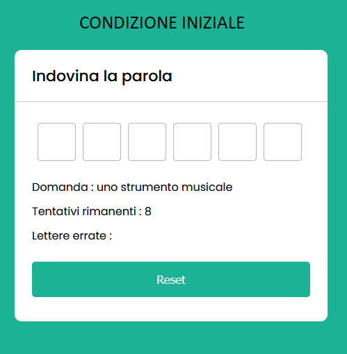
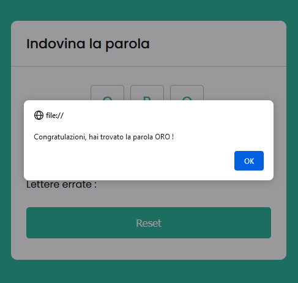
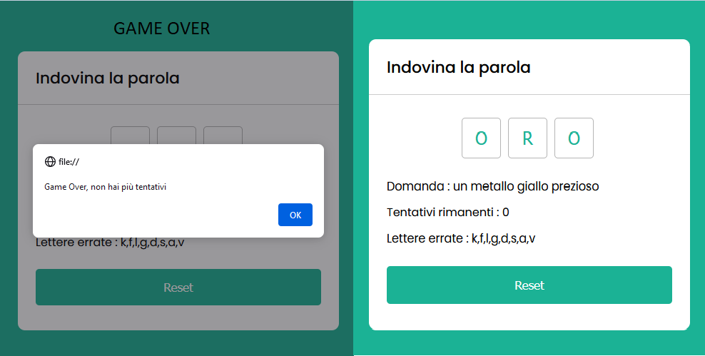

# Progetto Javascript Guess Word

Semplice progetto di un'indovina una parola con tutte le funzioni e i metodi per il funzionamento corretto :

- HTML (Markup)
- CSS (Markup)
- JAVASCRIPT

Condizione iniziale dell'app. tutto è generato dinamicamente

Condizione dell'app dopo che l'utente ha indovinato la parola

Condizione dell'app dopo che l'utente ha sbagliato la parola

